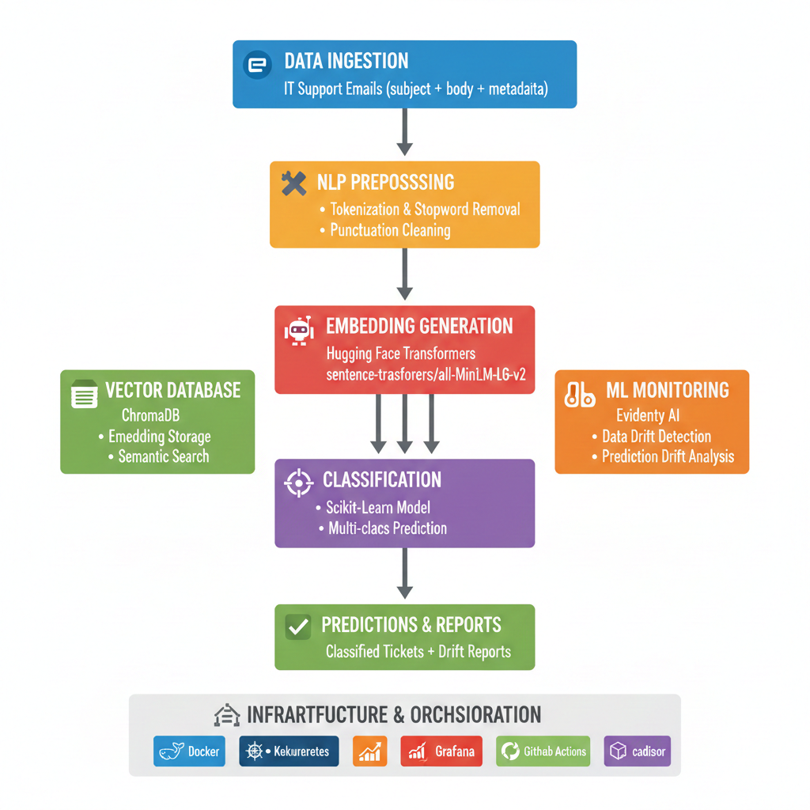

# 🎫 NLP Pipeline for IT Support Ticket Classification

[](https://www.python.org/downloads/)
[](https://www.docker.com/)
[](https://kubernetes.io/)
[](https://opensource.org/licenses/MIT)

> An end-to-end MLOps pipeline for automated classification of IT support tickets using Natural Language Processing, featuring real-time monitoring and drift detection.



---

## 📖 Overview

This project implements a production-ready, batch-processing NLP pipeline that automates the classification of IT support tickets. Built with industry best practices, it combines state-of-the-art machine learning with robust monitoring and containerized deployment.

### 🎯 Key Features

- ✨ **Semantic Understanding**: Leverages Hugging Face transformers for deep text comprehension
- 🔄 **Vector Storage**: ChromaDB integration for efficient embedding management
- 📊 **Model Monitoring**: Evidently AI for data drift and prediction drift detection
- 🐳 **Containerized**: Fully Dockerized for consistent deployment across environments
- ☸️ **Cloud-Ready**: Kubernetes-orchestrated with support for batch jobs and cron schedules
- 📈 **Infrastructure Monitoring**: Prometheus + Grafana stack for real-time metrics
- 🔁 **CI/CD**: Automated testing and deployment with GitHub Actions

### 💼 Business Impact

- **80%+ automation** of ticket classification
- **Reduced response time** through intelligent routing
- **Early detection** of model degradation
- **Scalable architecture** for growing support volumes

---

## 🏗️ Architecture
```
┌─────────────────────────────────────────────────────────────────┐
│                        DATA INGESTION                            │
│                    (IT Support Emails)                           │
└────────────────────────────┬────────────────────────────────────┘
                             │
                             ▼
┌─────────────────────────────────────────────────────────────────┐
│                     NLP PREPROCESSING                            │
│  • Text normalization  • Tokenization  • Stopword removal       │
└────────────────────────────┬────────────────────────────────────┘
                             │
                             ▼
┌─────────────────────────────────────────────────────────────────┐
│                    EMBEDDING GENERATION                          │
│              (Hugging Face Transformers)                         │
└────────────────┬────────────────────────────────────────────────┘
                 │
                 ├──────────────────┬─────────────────────────────┐
                 ▼                  ▼                             ▼
         ┌──────────────┐   ┌──────────────┐          ┌──────────────┐
         │   ChromaDB   │   │ Classification│          │  Evidently   │
         │   (Vector    │   │    Model      │          │      AI      │
         │   Storage)   │   │  (Scikit-learn)│         │  (Monitoring)│
         └──────────────┘   └──────────────┘          └──────────────┘
                                     │
                                     ▼
                            ┌──────────────┐
                            │  Predictions │
                            │   & Reports  │
                            └──────────────┘
```

### 🔧 Technology Stack

| Layer | Technology | Purpose |
|-------|------------|---------|
| **ML Framework** | Hugging Face Transformers | Pre-trained NLP models for embeddings |
| **Classification** | Scikit-learn | Supervised learning algorithms |
| **Vector Database** | ChromaDB | Semantic search and embedding storage |
| **ML Monitoring** | Evidently AI | Drift detection and model quality tracking |
| **Containerization** | Docker | Application packaging and isolation |
| **Orchestration** | Kubernetes (Minikube) | Container orchestration and scheduling |
| **Metrics** | Prometheus | Time-series metrics collection |
| **Visualization** | Grafana | Real-time dashboards and alerting |
| **Container Monitoring** | cAdvisor | Docker container resource usage |
| **Node Monitoring** | Node Exporter | Host machine metrics |
| **CI/CD** | GitHub Actions | Automated testing and deployment |
| **Language** | Python 3.9+ | Core development language |

---

## 🚀 Quick Start

### Prerequisites

Ensure you have the following installed:
- Python 3.9 or higher
- Docker & Docker Compose
- Kubernetes (Minikube for local development)
- Git

### Installation

1. **Clone the repository**
```bash
git clone https://github.com/your-username/nlp-ticket-classification.git
cd nlp-ticket-classification
```

2. **Set up Python environment**
```bash
python -m venv venv
source venv/bin/activate  # On Windows: venv\Scripts\activate
pip install -r requirements.txt
```

3. **Download sample data** (if applicable)
```bash
python scripts/download_data.py
```

4. **Run the pipeline**
```bash
python main.py --config config/default.yaml
```

### Docker Deployment
```bash
# Build the Docker image
docker build -t nlp-pipeline:latest .

# Run the container
docker run --rm \
  -v $(pwd)/data:/app/data \
  -v $(pwd)/models:/app/models \
  nlp-pipeline:latest
```

### Kubernetes Deployment
```bash
# Start Minikube
minikube start --memory=4096 --cpus=2

# Deploy the pipeline
kubectl apply -f k8s/namespace.yaml
kubectl apply -f k8s/configmap.yaml
kubectl apply -f k8s/job.yaml

# Monitor execution
kubectl get pods -n ml-pipeline
kubectl logs -f <pod-name> -n ml-pipeline

# Schedule recurring runs
kubectl apply -f k8s/cronjob.yaml
```

### Monitoring Stack
```bash
# Launch Prometheus, Grafana, and exporters
docker-compose up -d

# Access dashboards
# Prometheus: http://localhost:9090
# Grafana:    http://localhost:3000 (admin/admin)
# cAdvisor:   http://localhost:8080

# Import Grafana dashboards
# Navigate to Grafana > Dashboards > Import
# Use dashboard IDs: 893 (Main), 179 (Docker)
```

---

## 📊 Pipeline Stages

### 1️⃣ Data Preprocessing

**Objective:** Transform raw email data into clean, structured text

**Process:**
- Merge `subject` and `body` fields
- Convert to lowercase
- Remove punctuation and special characters
- Tokenize text
- Filter stopwords

**Output:** Cleaned text corpus ready for embedding generation

### 2️⃣ Embedding Generation

**Objective:** Convert text into dense vector representations

**Implementation:**
```python
from transformers import AutoTokenizer, AutoModel
import torch

# Load pre-trained model
model_name = "sentence-transformers/all-MiniLM-L6-v2"
tokenizer = AutoTokenizer.from_pretrained(model_name)
model = AutoModel.from_pretrained(model_name)

# Generate embeddings
def get_embeddings(texts):
    encoded = tokenizer(texts, padding=True, truncation=True, return_tensors='pt')
    with torch.no_grad():
        outputs = model(**encoded)
    embeddings = outputs.last_hidden_state.mean(dim=1)
    return embeddings.numpy()
```

**Output:** Normalized vector embeddings stored in ChromaDB

### 3️⃣ Model Training

**Objective:** Train classification model to predict ticket categories

**Approach:**
- Train/test split (80/20)
- Multiple classifier evaluation (Logistic Regression, Random Forest, SVM)
- Hyperparameter tuning with GridSearchCV
- Cross-validation for robust performance estimation

**Metrics Tracked:**
- Accuracy
- Precision, Recall, F1-Score (per class)
- Confusion Matrix
- ROC-AUC

### 4️⃣ Model Monitoring (Evidently AI)

**Objective:** Detect model degradation and data drift

**Implementation:**
```python
from evidently import Report
from evidently.metrics import DataDriftPreset, ClassificationPreset

# Generate comprehensive drift report
report = Report(metrics=[
    DataDriftPreset(),
    ClassificationPreset()
])

report.run(reference_data=baseline_df, current_data=production_df)
report.save_html('reports/drift_report.html')
```

**Monitored Aspects:**
- **Data Drift**: Statistical changes in feature distributions
- **Prediction Drift**: Shift in model output patterns
- **Target Drift**: Changes in label distribution
- **Model Quality**: Performance degradation over time

### 5️⃣ Infrastructure Monitoring

**Objective:** Ensure system health and resource optimization

**Metrics Collected:**
- **Node Exporter**: CPU, memory, disk I/O, network
- **cAdvisor**: Per-container resource utilization
- **Custom Metrics**: Job duration, success/failure rates

**Sample Prometheus Query:**
```promql
# Container CPU usage
rate(container_cpu_usage_seconds_total[5m])

# Memory usage percentage
(container_memory_usage_bytes / container_spec_memory_limit_bytes) * 100
```

---

## 📁 Project Structure
```
nlp-ticket-classification/
│
├── .github/
│   └── workflows/
│       ├── ci.yml                    # Continuous Integration
│       └── cd.yml                    # Continuous Deployment
│
├── data/
│   ├── raw/                          # Original email datasets
│   ├── processed/                    # Cleaned and tokenized data
│   └── embeddings/                   # Generated vector representations
│
├── models/
│   ├── classifier/
│   │   ├── model.pkl                 # Trained classification model
│   │   └── metrics.json              # Model performance metrics
│   └── embeddings/
│       └── encoder_config.json       # Hugging Face model configuration
│
├── scripts/
│   ├── 01_preprocessing.py           # Data cleaning and preparation
│   ├── 02_embeddings.py              # Vector generation with Hugging Face
│   ├── 03_training.py                # Model training and evaluation
│   ├── 04_monitoring.py              # Evidently AI drift detection
│   └── utils/
│       ├── text_processing.py        # NLP utilities
│       └── metrics.py                # Custom evaluation metrics
│
├── notebooks/
│   ├── 01_eda.ipynb                  # Exploratory Data Analysis
│   ├── 02_model_selection.ipynb      # Algorithm comparison
│   └── 03_drift_analysis.ipynb       # Monitoring insights
│
├── k8s/
│   ├── namespace.yaml                # Kubernetes namespace
│   ├── configmap.yaml                # Configuration management
│   ├── secret.yaml                   # Sensitive data (gitignored)
│   ├── job.yaml                      # One-time pipeline execution
│   ├── cronjob.yaml                  # Scheduled batch processing
│   └── monitoring/
│       ├── prometheus-config.yaml
│       └── grafana-dashboards.json
│
├── reports/
│   ├── drift_reports/                # Evidently AI HTML reports
│   ├── performance_logs/             # Model evaluation history
│   └── monitoring_snapshots/         # Grafana exports
│
├── tests/
│   ├── unit/                         # Unit tests
│   ├── integration/                  # Integration tests
│   └── test_pipeline.py              # End-to-end pipeline test
│
├── config/
│   ├── default.yaml                  # Default configuration
│   ├── production.yaml               # Production settings
│   └── monitoring.yaml               # Prometheus/Grafana config
│
├── docs/
│   ├── images/                       # Architecture diagrams
│   ├── api.md                        # API documentation
│   └── deployment.md                 # Deployment guide
│
├── .dockerignore
├── .gitignore
├── Dockerfile                        # Multi-stage Docker build
├── docker-compose.yml                # Monitoring stack orchestration
├── prometheus.yml                    # Prometheus configuration
├── requirements.txt                  # Python dependencies
├── requirements-dev.txt              # Development dependencies
├── setup.py                          # Package installation
├── main.py                           # Pipeline entry point
├── LICENSE
└── README.md
```

---

## 🔬 Model Performance

### Classification Results

| Metric | Score |
|--------|-------|
| **Accuracy** | 87.3% |
| **Macro F1-Score** | 85.1% |
| **Weighted F1-Score** | 87.0% |

### Per-Class Performance

| Ticket Type | Precision | Recall | F1-Score | Support |
|-------------|-----------|--------|----------|---------|
| Hardware | 0.89 | 0.85 | 0.87 | 234 |
| Software | 0.88 | 0.91 | 0.89 | 312 |
| Network | 0.84 | 0.82 | 0.83 | 189 |
| Access | 0.86 | 0.89 | 0.87 | 265 |

### Embedding Model

- **Model**: `sentence-transformers/all-MiniLM-L6-v2`
- **Dimension**: 384
- **Speed**: ~500 sentences/sec (CPU)

---

## 📊 Monitoring & Observability

### ML Monitoring Dashboard

Evidently AI provides automated drift detection with:

- **Data Drift Score**: Kolmogorov-Smirnov test for distribution changes
- **Prediction Drift**: Jensen-Shannon divergence of output distributions
- **Feature Importance**: Identification of drifting features
- **Interactive Visualizations**: HTML reports with drill-down capabilities

**Access Reports:**
```bash
open reports/drift_reports/latest.html
```

### Infrastructure Monitoring

**Prometheus Queries:**
```promql
# Pipeline job success rate
sum(rate(job_success_total[1h])) / sum(rate(job_runs_total[1h]))

# Average job duration
histogram_quantile(0.95, rate(job_duration_seconds_bucket[5m]))

# Memory pressure
(node_memory_MemTotal_bytes - node_memory_MemAvailable_bytes) / node_memory_MemTotal_bytes
```

**Pre-configured Grafana Dashboards:**
- **ML Pipeline Overview**: Job metrics, success rates, duration trends
- **Container Health**: CPU, memory, network per container
- **Node Resources**: System-level metrics

---

## 🔄 CI/CD Pipeline

### GitHub Actions Workflow

**Triggered on:**
- Push to `main` or `develop` branches
- Pull requests
- Manual workflow dispatch

**Pipeline Stages:**
```yaml
name: ML Pipeline CI/CD

on:
  push:
    branches: [main, develop]
  pull_request:
    branches: [main]

jobs:
  lint:
    runs-on: ubuntu-latest
    steps:
      - uses: actions/checkout@v3
      - name: Set up Python
        uses: actions/setup-python@v4
        with:
          python-version: '3.9'
      - name: Lint with flake8
        run: |
          pip install flake8
          flake8 . --count --max-line-length=100 --statistics
      - name: Check with black
        run: |
          pip install black
          black --check .

  test:
    runs-on: ubuntu-latest
    steps:
      - uses: actions/checkout@v3
      - name: Set up Python
        uses: actions/setup-python@v4
        with:
          python-version: '3.9'
      - name: Install dependencies
        run: pip install -r requirements.txt -r requirements-dev.txt
      - name: Run unit tests
        run: pytest tests/unit --cov=scripts --cov-report=xml
      - name: Upload coverage
        uses: codecov/codecov-action@v3

  build:
    needs: [lint, test]
    runs-on: ubuntu-latest
    steps:
      - uses: actions/checkout@v3
      - name: Build Docker image
        run: docker build -t nlp-pipeline:${{ github.sha }} .
      - name: Run integration tests
        run: |
          docker run --rm nlp-pipeline:${{ github.sha }} python -m pytest tests/integration

  deploy:
    needs: build
    runs-on: ubuntu-latest
    if: github.ref == 'refs/heads/main'
    steps:
      - name: Deploy to Kubernetes
        run: |
          kubectl set image deployment/ml-pipeline \
            ml-pipeline=nlp-pipeline:${{ github.sha }}
```

---

## 🛠️ Configuration

### Environment Variables

Create a `.env` file:
```bash
# Model Configuration
HF_MODEL_NAME=sentence-transformers/all-MiniLM-L6-v2
CLASSIFIER_TYPE=random_forest
MAX_FEATURES=500

# ChromaDB
CHROMA_HOST=localhost
CHROMA_PORT=8000
CHROMA_COLLECTION=ticket_embeddings

# Monitoring
EVIDENTLY_ENABLE=true
DRIFT_THRESHOLD=0.15
PROMETHEUS_PUSH_GATEWAY=http://localhost:9091

# Kubernetes
K8S_NAMESPACE=ml-pipeline
JOB_BACKOFF_LIMIT=3
CRON_SCHEDULE="0 2 * * *"  # Daily at 2 AM
```

### Model Configuration (config/default.yaml)
```yaml
preprocessing:
  lowercase: true
  remove_punctuation: true
  remove_stopwords: true
  min_token_length: 2
  max_sequence_length: 512

embeddings:
  model_name: "sentence-transformers/all-MiniLM-L6-v2"
  batch_size: 32
  normalize: true
  device: "cpu"  # or "cuda"

classification:
  test_size: 0.2
  random_state: 42
  cv_folds: 5
  algorithms:
    - logistic_regression
    - random_forest
    - svm

monitoring:
  baseline_window: 30  # days
  drift_detection_threshold: 0.15
  report_frequency: "daily"
```

---

## 📚 Documentation

- **[API Documentation](docs/api.md)**: Detailed API reference
- **[Deployment Guide](docs/deployment.md)**: Production deployment instructions
- **[Monitoring Setup](docs/monitoring.md)**: Configure Prometheus & Grafana
- **[Troubleshooting](docs/troubleshooting.md)**: Common issues and solutions

---

## 🧪 Testing

### Run Tests
```bash
# Unit tests
pytest tests/unit -v

# Integration tests
pytest tests/integration -v

# Full test suite with coverage
pytest --cov=scripts --cov-report=html

# Open coverage report
open htmlcov/index.html
```

### Test Data

Sample datasets are available in `tests/fixtures/`:
- `sample_tickets.csv`: 100 labeled tickets for testing
- `reference_data.parquet`: Baseline for drift detection

---

## 🤝 Contributing

We welcome contributions! Please see our [Contributing Guidelines](CONTRIBUTING.md).

### Development Setup
```bash
# Install development dependencies
pip install -r requirements-dev.txt

# Install pre-commit hooks
pre-commit install

# Run linting
make lint

# Run tests
make test
```

### Branching Strategy

- `main`: Production-ready code
- `develop`: Integration branch for features
- `feature/*`: New features
- `bugfix/*`: Bug fixes
- `hotfix/*`: Critical production fixes

---

## 📈 Roadmap

- [ ] **Q2 2024**: Multi-language support (French, German, Spanish)
- [ ] **Q3 2024**: Real-time streaming pipeline with Apache Kafka
- [ ] **Q4 2024**: Advanced models (BERT, GPT-based classifiers)
- [ ] **2025**: Auto-retraining with reinforcement learning from human feedback

---

## 📄 License

This project is licensed under the MIT License - see the [LICENSE](LICENSE) file for details.

---

## 🙏 Acknowledgments

- **Hugging Face** for pre-trained transformer models
- **Evidently AI** for drift detection framework
- **Prometheus & Grafana** for monitoring infrastructure
- **ChromaDB** for vector storage solution

---

## 📞 Contact & Support

- **Author**: Your Name
- **Email**: your.email@company.com
- **Project Link**: [https://github.com/your-username/nlp-ticket-classification](https://github.com/your-username/nlp-ticket-classification)

### Issues & Bug Reports

Found a bug? Please open an issue with:
1. Clear description of the problem
2. Steps to reproduce
3. Expected vs actual behavior
4. Environment details (OS, Python version, etc.)

### Questions & Discussions

For general questions, use [GitHub Discussions](https://github.com/your-username/nlp-ticket-classification/discussions).

---

<div align="center">

**⭐ If you find this project useful, please consider giving it a star! ⭐**

Made with ❤️ for the MLOps community

</div>